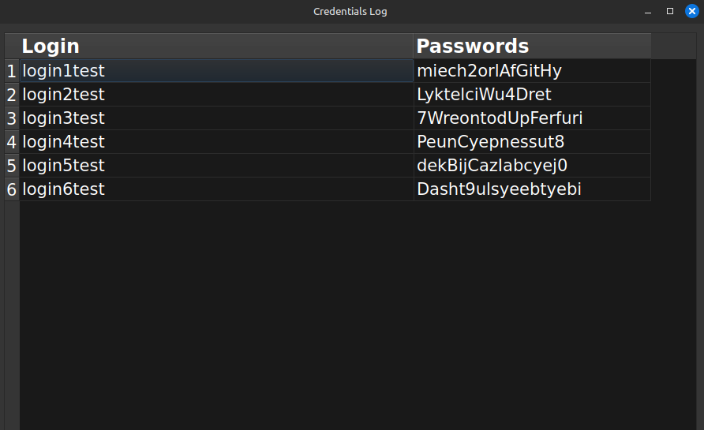

#### ***PSWRD***

#### ***Script Rundown***  

*pswrd.py*  
This was an idea i had of making an app that contains all my passwords and credentials
in a concise interface.  
Basically what it does is that it takes a plain or text file,
uses an equal sign pattern to select what is login and what is password, 
then puts them in a dictionary and presents them in the GUI Interface using
PyQt5.  

There's also the shell script *pswrd.sh*.  
Which was made to create a secure password, associate it to a given login
and then save it on to the .credentials file (which you can change if you want, 
you just need to change the variable SAVE_FILE on pswrd.py and pswrd.sh).  

This is how it saves them: 
<login>=<password>

This script was made mainly for practicing and not for actual use,
but if you want to you can create a desktop application and associate it with the python file,
it's fairly simple to do.

#### ***Dependencies***  

* PyQt5: pip install PyQt5
* apg: sudo apt install apg // sudo dnf install apg

#### ***How to Run***  

* git clone <>
* cd pswrd/
* chmod u+x pswrd.sh .credentials
* ./pswrd.sh <login>
* python3 pswrd.py

